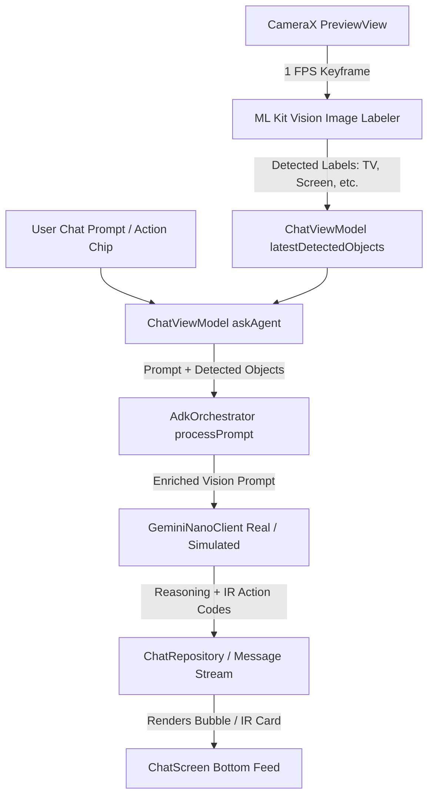

# Commercial Killer — On-Device Multimodal AI Agent

A 100% local, on-device AI Agent running on **Google Pixel 8** that watches live video, listens to audio, displays a real-time split-screen thinking/telemetry dashboard, and physically controls appliances via a **USB IR Blaster**.

---

## 🎯 Target Hardware & System Specs

* **Device**: Google Pixel 8 (Google Tensor G3 NPU, 8 GB RAM, Android 16 / API 36)
* **AI Runtime**: On-device **Gemini Nano via Android AICore** (`com.google.ai.edge.aicore`) + Local **ML Kit Vision Engine** + Edge Simulated fallback.
* **Physical Output**: USB-OTG IR Blaster (via Android USB Host API + `usb-serial-for-android`)
* **Base Architecture**: Clean Architecture + MVVM (Kotlin, Jetpack Compose, Hilt, Coroutines/Flow)

---

## 📱 UI Design & Layout Architecture

The main application screen features a **Split-Screen Dashboard** optimized for portrait mode:

```
┌─────────────────────────────────────────────────────────────┐
│                 Top App Bar & Status Header                 │
│  [ Commercial Killer ]  [Real/Sim Switch]  [⚙️ Settings] [📈]│
├─────────────────────────────────────────────────────────────┤
│                                                             │
│                    TOP PANEL (50% Height)                   │
│               🎥 Live Video Viewfinder & Frame Sampler      │
│  - CameraX Surface Preview (aimed at TV screen)             │
│  - Real-time sampling indicator (1 FPS keyframes)           │
│  - Visual TV aiming reticle guide overlay                   │
│  - [👀 DETECTED IN SCENE: Television (94%) • Screen (89%)]  │
│                                                             │
├─────────────────────────────────────────────────────────────┤
│                                                             │
│                   BOTTOM PANEL (50% Height)                 │
│               💬 Generated Stream & IR Action Feed          │
│  - Real-time LLM token generation stream                    │
│  - Agent internal reasoning & thinking trace                │
│  - Emitted IR Action cards:                                 │
│      [TRANSMITTED IR SIGNAL] IR-Mute on 0x0ae (NEC 38kHz)   │
│      [TRANSMITTED IR SIGNAL] IR-Unmute on 0x0ae             │
│                                                             │
│  - 3-Button Action Row:                                     │
│    [👀 What do you see?] [⚡ Detect & Mute] [⚡ Unmute]     │
│  - Prompt Input Bar with Send action                        │
└─────────────────────────────────────────────────────────────┘
```

---

## 🧠 Multimodal Context & Prompt Management Architecture

### 1. Current State (How Prompts & Context Flow Today)



* **Vision Ingestion (`CameraPreview.kt`)**: Extracts keyframes every 1000ms and runs on-device Google ML Kit Vision labeling.
* **Context Assembly (`AdkOrchestrator.kt`)**: Combines the user's immediate question with the active frame's detected objects into a formatted vision prompt (`VISION_QUERY: Detected in current video frame: [labels]. User asks: $prompt`).
* **Inference Engine (`FakeGeminiNanoClient.kt` / `RealGeminiNanoClient.kt`)**: Evaluates commercial vs. program state, formulates reasoning, and attaches structured IR hex payloads (e.g. `[IR-ACTION] IR-Mute on 0x0ae`).
* **Persistence & Feed (`ChatViewModel.kt`)**: Posts both user commands and agent outputs into the Room database message stream.

---

### 2. Design Blueprint: Advanced Continuous Multimodal Context Pipeline

To evolve beyond single-turn prompt-response into a continuous, autonomous perception-action loop, the context manager will implement:

#### A. Sliding Temporal Vision & Audio Buffer (Short-Term Sensor Memory)
* Maintain a rolling 30-second timeline of sensor events:
  * Frame timestamps + detected labels + confidence deltas.
  * Scene cut detection (sudden luminance or histogram shift indicating commercial cut).
  * Audio volume/RMS spikes (commercials are often compressed to be louder than broadcast shows).
* When evaluating ad likelihood, the agent inspects the **trajectory across time**, not just an isolated frame.

#### B. User Directive & Behavioral Memory (Long-Term Conversational Memory)
* User prompts aren't just one-off questions; they become **standing agent policies**:
  * *Example*: User types *"Never mute football games, but always mute car commercials."*
  * The context manager extracts and stores this as an active rule in `UserPreferencesRepository`.
  * Injected as a persistent `[USER BEHAVIORAL POLICIES]` block into every subsequent autonomous evaluation prompt.

#### C. Structured Multimodal Prompt Template
Every inference cycle will assemble a standardized, token-budgeted prompt structure:
```text
[SYSTEM DIRECTIVE]
You are Commercial Killer, an autonomous on-device TV monitor and appliance controller.
Your goal is to monitor live television video/audio, recognize commercials, and emit IR signals.

[ACTIVE USER DIRECTIVES]
- Auto-mute commercials: ENABLED
- Sensitivity: HIGH
- Custom rules: {User-defined instructions from chat history}

[TEMPORAL SENSOR CONTEXT (Last 15 seconds)]
- T-10s: Scene: TV Show, Volume: Normal (RMS 0.22), Objects: Person (90%), Room (85%)
- T-2s: SCENE CUT DETECTED. Volume: Spike +6dB (RMS 0.65)
- T-0s (Current): Objects: Text Banner (94%), Car (91%), Brand Logo (87%)

[CURRENT TRIGGER / QUERY]
User Prompt / Autonomous Watchdog Tick: "Evaluate commercial probability and take action."

[OUTPUT FORMAT]
1. Observation & Reasoning
2. Commercial Confidence Score (0.0 to 1.0)
3. Action Command: [IR-ACTION] <Command> on <HexCode> (or NO_ACTION)
```

#### D. Dual-Loop Context Cycle
1. **Interactive Loop (User-Initiated)**: Chat prompts, questions (*"what objects do you see"*, *"why did you mute?"*), and manual override chips.
2. **Autonomous Loop (Watchdog-Initiated)**: Background coroutine running every 2–3 seconds that feeds the sliding context into the NPU without requiring manual button clicks.

---

## 📋 Core System Requirements

1. **100% Local Processing**: Zero cloud dependency, zero external network inference.
2. **Vision Sampling (CameraX + ML Kit)**: 1 FPS keyframe extraction from rear camera aimed at TV / display with real-time on-device object detection.
3. **Split-Panel UI (Compose)**: Top panel renders live camera stream & vision overlay; bottom panel displays real-time agent output & IR events in portrait orientation.
4. **Agentic Tool Execution & Observability**: Real-time telemetry sheet tracing every tool execution, frame latency, and NPU draft step.
5. **System & AI Diagnostics**: Modal displaying AICore package details, Tensor G3 NPU info, RAM metrics, and direct link to AICore system settings.
6. **USB IR Action Engine**:
   * *Phase 2 (Simulation)*: Formats emitted IR signals as structured stream events (`[IR-ACTION] IR-Mute on 0x0ae`).
   * *Phase 3 (Physical)*: Transmits raw NEC/Sony/RC5 hex pulses over USB serial adapter (CH340 / CP2102).
7. **Audio Listening (AudioRecord / VAD)**: Real-time voice activity detection and local speech input.

---

## 📝 Roadmap & Progress

### Phase 1: Toolchain, Baseline & Automated Testing
- [x] Configure JDK 17/21 and Android SDK platform-tools in system PATH
- [x] Connect and authorize Pixel 8 (`adb devices`)
- [x] Link and push codebase to personal GitHub (`jimcollinsworth/commercial-killer`)
- [x] Verify baseline project compilation (`./gradlew.bat assembleDebug`)
- [x] Install baseline app onto Pixel 8 (`./gradlew.bat installDebug`)
- [x] Add automated UI test (`AppLaunchUiTest.kt`) in `app/src/androidTest` for "app loads and displays first screen"
- [x] Setup `TestActivity` with `@AndroidEntryPoint` for clean Compose + Hilt UI testing

### Phase 2: Split UI, Real-Time Vision & Simulated IR Actions
- [x] Add CameraX dependencies (`camera-camera2`, `camera-lifecycle`, `camera-view`) to `:feature-chat` and `:app`
- [x] Implement `CameraPreview` (1 FPS keyframe buffer extraction + TV framing reticle)
- [x] Integrate Google ML Kit On-Device Vision (`mlkit-image-labeling`) for real-time object classification
- [x] Implement Split-Screen UI Layout in `ChatScreen.kt` (Top: Camera Viewfinder, Bottom: Generated Stream & IR Feed)
- [x] Optimize portrait layout with 3 action chips (`👀 What do you see?`, `⚡ Detect & Mute`, `⚡ Unmute`)
- [x] Add **System & AI Diagnostics Dialog** with AICore package stats, hardware telemetry, and deep-link button
- [x] Wire live vision object detection context into AI prompt reasoning pipeline
- [x] Add Agent Observability telemetry sheet (`AgentObservabilitySheet.kt`)
- [x] Scaffold IR Action Emitting Tool with structured text output (e.g. `[IR-ACTION] IR-Mute on 0x0ae`)

### Phase 2.5: Multimodal Context & Prompt Management (Design & Architecture)
- [x] Document current state of prompt assembly, vision context flow, and orchestrator dispatch
- [ ] Implement `SlidingVisionBuffer` (rolling 30s keyframe, object delta, and scene cut history)
- [ ] Implement `UserDirectivesRepository` (persistent user behavioral rules parsed from chat conversation)
- [ ] Implement `MultimodalPromptAssembler` (standardized context budget, system directives, sensor timeline)
- [ ] Implement Autonomous Background Perception Loop (periodic evaluation without manual button presses)

### Phase 3: Physical USB IR Blaster & Audio Subsystem
- [ ] Add `usb-serial-for-android` dependency to `:data` / `:ai-runtime` module
- [ ] Implement `UsbIrTransmitter` (USB Host permission handling + serial payload driver)
- [ ] Wire physical USB serial transmission to execute IR commands when commercial/ad events trigger
- [ ] Add AudioRecord / VAD listening engine (`AudioStreamListener.kt`)
- [ ] End-to-End Closed-Loop Testing (Camera watches TV -> Detects commercial -> Emits physical USB IR signal -> Mutes TV audio)

---

## 🛠️ Verification & Test Commands

* **Run Automated UI Tests on Pixel 8**:
  ```powershell
  .\gradlew.bat connectedAndroidTest
  ```
* **Run Unit Tests on JVM**:
  ```powershell
  .\gradlew.bat test
  ```
* **Build & Install Debug APK**:
  ```powershell
  .\gradlew.bat installDebug
  ```
